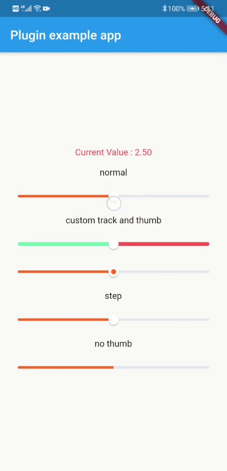

# better_cupertino_slider

Advanced cupertino slider based on CupertinoSlider.



## Install Started

1. Add this to your **pubspec.yaml** file:

```yaml
dependencies:
  better_cupertino_slider: ^0.0.2
```

2. Install it

```bash
$ flutter packages get
```

## Normal usage

```dart
BetterCupertinoSlider(
  min: 0.0,
  max: maxValue,
  value: sliderValue,
  configure: BetterCupertinoSliderConfigure(
    trackHorizontalPadding: 8.0,
    trackHeight: 4.0,
    trackLeftColor: Colors.greenAccent,
    trackRightColor: Colors.grey.withOpacity(0.3),
    thumbRadius: 8.0,
    thumbPainter: (canvas, rect){
      final RRect rrect = RRect.fromRectAndRadius(
        rect,
        Radius.circular(rect.shortestSide / 2.0),
      );
      canvas.drawRRect(rrect, Paint()..color = Colors.red);
    },
  ),
  onChanged: (value) {
    setState(() {
      sliderValue = value;
    });
  },
),
```

## Feature
- [x] custom track and thumb
- [x] step slider
- [x] as linear progress
